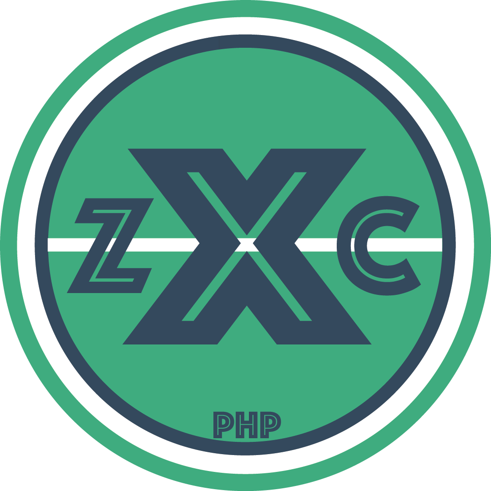

<p align="center">
  
</p>
<h2 align="center">ZXC_PHP</h2> . 


##Getting Started

###Project folder structure
This guide will describe the parameters based on the following structure of project directories

    ├── MyProject
    │   ├── Structures
    │   |   |   └+──StructAuth.php
    │   ├── config
    |   |   └+──config.php
    │   ├── server
    |   |   ├──MyClases
    |   |   |   └+──-MyClases\BestClass.php # MyClases\ is namespace
    |   |   ├──ZXC_PHP
    |   |       └── core
    |   |          └+---index.php #This is ROOT dir for ZXC_PHP
    │   ├── web  
    |   |   +──index.php 
    │   └──        
    └── ...

###Config file description
```php
'ZXC' => [
        ...Other config description for ZXC_PHP...
    ]
```
#### Autoload config
```php
'ZXC' => [
        ....
        'Autoload' => [
            '../../../server' => true
        ],
        ...
    ]
```
#### Structure SQL  
##### StructureControl  
```php
'ZXC' => [
        ....
        'Modules' => [
            'Structures' => [
                'class' => '\ZXC\Modules\SQL\StructureControl',
                'options' => [
                    'dir' => '../../../server/Structures'
                ]
            ],
        ],
        ...
    ]
```

#### Routing  
```php
'ZXC' => [
    'Router' => [
        'methods' => ['POST' => true, 'GET' => true, 'OPTIONS' => true],
        'routes' => [
            [
                'route' => 'POST|/|MyClasesNamespace\BestClass:create'
            ],
            [
                'route' => 'POST|/|FakeClassForTest:fakeMethod'
            ],
            [
                'route' => 'GET|/',
                'before' => function () {
                    return ' before';
                },
                'callback' => function ($zxc, $params) {
                    return $params['resultBefore'] . ' <= HI! => ';
                },
                'after' => function ($zxc, $params) {
    
                    return $params['resultMain'] . 'after';
                },
                'hooksResultTransfer' => true
            ],
            [
                'route' => 'GET|/:user',
                'before' => function () {
                    return 'You are the best ';
                },
                'callback' => function ($zxc, $params) {
                    return $params['resultBefore'] . 'user "' . $params['routeParams']['user'] . '"';
                },
                'after' => function ($zxc, $params) {
                    return $params['resultMain'] . ' after me %)';
                },
                'hooksResultTransfer' => true
            ]
        ],
    ]
]
```

###Web server settings

####IIS
1. Activate URL Rewrite  
2. Create web.config file in your application root directory.
   ```xml 
   <?xml version="1.0" encoding="UTF-8"?>
   <configuration>  
     <system.webServer>
       <rewrite>
         <rules>
           <rule name="Application" stopProcessing="true">
             <match url=".*" ignoreCase="false" />
             <conditions logicalGrouping="MatchAll">
               <add input="{REQUEST_FILENAME}" matchType="IsFile" ignoreCase="false" negate="true" />
               <add input="{REQUEST_FILENAME}" matchType="IsDirectory" ignoreCase="false" negate="true" />
             </conditions>
             <action type="Rewrite" url="index.php" appendQueryString="true" />
           </rule>
         </rules>
       </rewrite>
     </system.webServer>
   </configuration>
    ```
2. Restart IIS.
